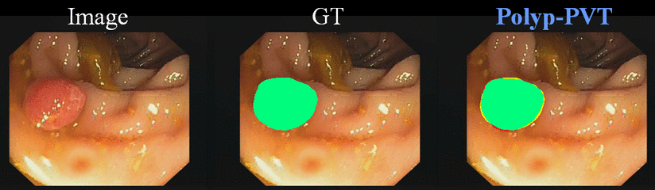

# Polyp-PVT

by Bo Dong, Wenhai Wang, Jinpeng Li, Deng-Ping Fan.

This repo is the official implementation of ["Polyp-PVT: Polyp Segmentation with Pyramid Vision Transformers"](https://arxiv.org/pdf/2108.06932.pdf). 





## 1. Introduction
**Polyp-PVT** is initially described in [arxiv](https://arxiv.org/pdf/2108.06932.pdf).


Most polyp segmentation methods use CNNs as their backbone, leading to two key issues when exchanging information between the encoder and decoder: 1) taking into account the differences in contribution between different-level features; and 2) designing effective mechanism for fusing these features.
Different from existing CNN-based methods, we adopt a transformer encoder, which learns more powerful and robust representations. 
In addition, considering the image acquisition influence and elusive properties of polyps, we introduce three novel modules, including a cascaded fusion module (CFM), a camouflage identification module (CIM), a and similarity aggregation module (SAM).
Among these, the CFM is used to collect the semantic and location information of polyps from high-level features, while the CIM is applied to capture polyp information disguised in low-level features. 
With the help of the SAM, we extend the pixel features of the polyp area with high-level semantic position information to the entire polyp area, thereby effectively fusing cross-level features.
The proposed model, named **Polyp-PVT** , effectively suppresses noises in the features and significantly improves their expressive capabilities. 


Polyp-PVT achieves strong performance on image-level polyp segmentation (`0.808 mean Dice` and `0.727 mean IoU` on ColonDB) and
video polyp segmentation (`0.880 mean dice` and `0.802 mean IoU` on CVC-300-TV), surpassing previous models by a large margin.


## 2. Framework Overview


## 3. Results
### 3.1 Image-level Polyp Segmentation


### 3.2 Image-level Polyp Segmentation Compared Results:
We also provide some result of baseline methods, You could download from [Google Drive](https://drive.google.com/file/d/1xvjRl70pZbOO6wI5p94CSpZK2RAUnUnx/view?usp=sharing)/[Baidu Drive](https://pan.baidu.com/s/14HtaePQk46YFDH5jRQDhwQ?pwd=qw9i) [code:qw9i], including our results and that of compared models.

### 3.3 Video Polyp Segmentation


### 3.4 Video Polyp Segmentation Compared Results:
We also provide some result of baseline methods, You could download from [Google Drive](https://drive.google.com/file/d/1mITUCrrKhkwdsqyDd9-TRKF_K79Ehf8N/view?usp=sharing)/[Baidu Drive](https://pan.baidu.com/s/1K7taIbZS4n05BxasckLJ9A?pwd=rtvt) [code:rtvt], including our results and that of compared models.

## 4. Usage:
### 4.1 Recommended environment:
```
Python 3.8
Pytorch 1.7.1
torchvision 0.8.2
```
### 4.2 Data preparation:
Downloading training and testing datasets and move them into ./dataset/, which can be found in this [Google Drive](https://drive.google.com/file/d/1pFxb9NbM8mj_rlSawTlcXG1OdVGAbRQC/view?usp=sharing)/[Baidu Drive](https://pan.baidu.com/s/1OBVivLJAs9ZpnB5I2s3lNg) [code:dr1h].


### 4.3 Pretrained model:
You should download the pretrained model from [Google Drive](https://drive.google.com/drive/folders/1Eu8v9vMRvt-dyCH0XSV2i77lAd62nPXV?usp=sharing)/[Baidu Drive](https://pan.baidu.com/s/1Vez7iT2v_g7VYsDxRGE8HA) [code:w4vk], and then put it in the './pretrained_pth' folder for initialization. 

### 4.4 Training:
Clone the repository:
```
git clone https://github.com/DengPingFan/Polyp-PVT.git
cd Polyp-PVT 
bash train.sh
```

### 4.5 Testing:
```
cd Polyp-PVT 
bash test.sh
```

### 4.6 Evaluating your trained model:

Matlab: Please refer to the work of MICCAI2020 ([link](https://github.com/DengPingFan/PraNet)).

Python: Please refer to the work of ACMMM2021 ([link](https://github.com/plemeri/UACANet)).

Please note that we use the Matlab version to evaluate in our paper.


### 4.7 Well trained model:
You could download the trained model from [Google Drive](https://drive.google.com/drive/folders/1xC5Opwu5Afz4xiK5O9v4NnQOZY0A9-2j?usp=sharing)/[Baidu Drive](https://pan.baidu.com/s/1csPvdWqtbPBGrUWYO346Ug) [code:9rpy] and put the model in directory './model_pth'.

### 4.8 Pre-computed maps:
[Google Drive](https://drive.google.com/file/d/1L0pFFmd9fbqnJnBwrM9cEV5nlRS32mbQ/view?usp=sharing)/[Baidu Drive](https://pan.baidu.com/s/1UO1VaqXRRFNq23ku9yfMaw) [code:x3jc]


## 5. Citation:
```
@aticle{dong2021PolypPVT,
  title={Polyp-PVT: Polyp Segmentation with PyramidVision Transformers},
  author={Bo, Dong and Wenhai, Wang and Deng-Ping, Fan and Jinpeng, Li and Huazhu, Fu and Ling, Shao},
  journal={arXiv preprint arXiv:2108.06932v3},
  year={2021}
}
```

## 6. Acknowledgement
We are very grateful for these excellent works [PraNet](https://github.com/DengPingFan/PraNet), [EAGRNet](https://github.com/tegusi/EAGRNet) and [MSEG](https://github.com/james128333/HarDNet-MSEG), which have provided the basis for our framework.

## 7. FAQ:
If you want to improve the usability or any piece of advice, please feel free to contact me directly (bodong.cv@gmail.com).

## 8. License
The source code is free for research and education use only. Any comercial use should get formal permission first.
